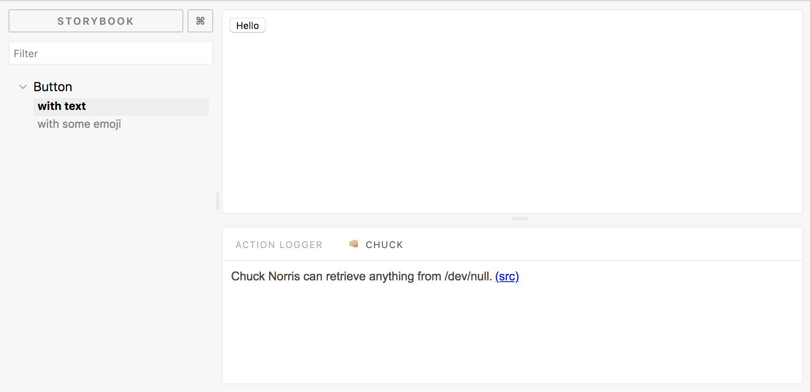

# Chuck Norris ❤️ Storybook

👊 The only real Storybook add-on you will ever really need.

[](https://api.chucknorris.io)

## Installation

Install the following npm module:

```sh
npm i --save-dev storybook-addon-chucknorris
```

or with yarn:

```sh
yarn add -D storybook-addon-chucknorris
```

## Basic Usage

Simply import the Storybook ChuckNorris Addon in the `addons.js` file in your `.storybook` directory.

```javascript
import 'storybook-addon-chucknorris/register';
```

This will register the Chuck Norris Addon to Storybook and will show up in the action area.
